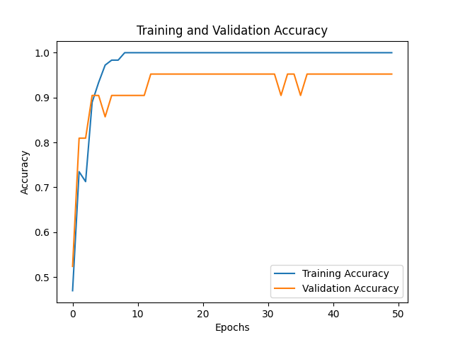
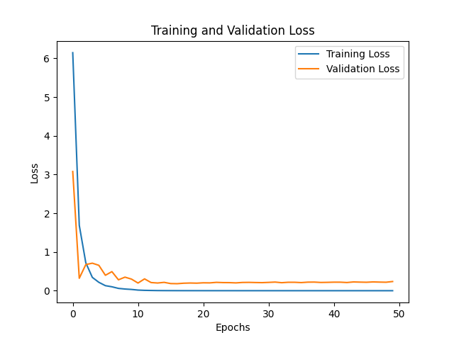
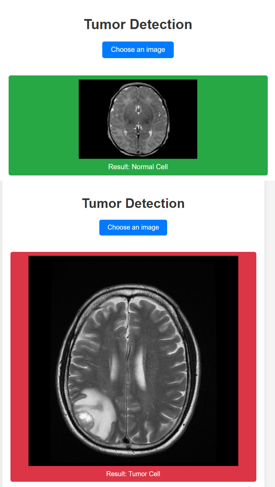

# NeuroDetect

This project is a web application for detecting brain tumors in MRI images using Convolutional Neural Networks (CNNs). The app allows users to upload an MRI image, and it predicts whether the image shows a normal or a tumor cell.

## Table of Contents

- [Project Overview](#project-overview)
- [Technologies Used](#technologies-used)
- [Dataset](#dataset)
- [Preprocessing](#preprocessing)
- [Model Architecture](#model-architecture)
- [Results](#results)
- [Web Application](#web-application)
- [How to Run](#how-to-run)
- [Project Structure](#project-structure)
- [Acknowledgements](#acknowledgements)

## Project Overview

The purpose of this project is to utilize Convolutional Neural Networks (CNNs) to classify MRI images of the brain into two categories: normal and tumor. This classification aids in the early detection and treatment of brain tumors.

## Technologies Used

- **Programming Language**: Python
- **Web Framework**: Flask
- **Data Processing**: NumPy, pandas
- **Visualization**: Matplotlib, Seaborn
- **Image Processing**: OpenCV, Pillow
- **Machine Learning**: TensorFlow, scikit-learn

## Dataset

The dataset consists of brain MRI images categorized into two classes:
- **Normal**: Images without brain tumors.
- **Tumor**: Images with brain tumors.

### Data Collection

- **Normal Cells**: `/kaggle/input/brain-mri-images-for-brain-tumor-detection/no`
- **Tumor Cells**: `/kaggle/input/brain-mri-images-for-brain-tumor-detection/yes`

### Data Distribution

- **Normal Cells**: 98 images
- **Tumor Cells**: 155 images

## Preprocessing

Images were preprocessed using the following steps:
1. **Resizing**: Each image was resized to 128x128 pixels.
2. **Normalization**: Pixel values were scaled to the range [0, 1].
3. **Conversion to RGB**: Images were converted to RGB format.
4. **Labeling**: 
   - 0: Normal
   - 1: Tumor

## Model Architecture

The CNN model was built using TensorFlow and Keras. The architecture consists of:
1. **Convolutional Layers**: Extract features from the input images.
2. **MaxPooling Layers**: Reduce the dimensionality of feature maps.
3. **Flatten Layer**: Flatten the input to a vector.
4. **Dense Layers**: Fully connected layers for classification.

### Model Summary

- **Conv2D**: 64 filters, kernel size (3,3), activation 'relu'
- **MaxPooling2D**: Pool size (2,2)
- **Flatten**: Flatten the input
- **Dense**: 128 units, activation 'relu'
- **Output Layer**: 2 units, activation 'sigmoid'

### Compilation

- **Optimizer**: Adam
- **Loss Function**: Sparse Categorical Crossentropy
- **Metrics**: Accuracy

### Training

- **Epochs**: 50
- **Validation Split**: 10%

## Results

The model achieved an accuracy of 86% on the test set.

### Training and Validation Accuracy



### Training and Validation Loss



## Web Application

The web application allows users to upload MRI images and receive predictions on whether the image indicates a normal brain or a tumor.

### User Interface

- **Home Page**: Upload MRI image
- **Result Page**: Display prediction result and uploaded image
  


## How to Run

### Prerequisites

- Python 3.6 or higher
- Virtual environment (optional but recommended)

# How to Run

### Prerequisites

- Python 3.6 or higher
- Virtual environment (optional but recommended)

### Installation

1. **Clone the repository**:
   ```bash
   git clone https://github.com/agprateek7/brain-tumor-detection-web-app.git
   cd tumor-detection-web-app
   
2. **Install the required libraries:**:
   ```bash
   pip install -r requirements.txt
   
3. **Run the Flask app:**:
   ```bash
   python app.py
   
4. **Open your web browser and go to http://127.0.0.1:5000**.

# Project Structure

1. **app.py**: Main application file.
2. **templates/index.html**: HTML template for the web app.
3. **static/styles.css**: CSS file for styling the web app.
4. **requirements.txt**: List of required Python libraries.
5. **tumor_detection.h5**: Pre-trained model file.
6. **screenshots/**:
   - result_page.jpg: Screenshot of the web app interface.
   - loss_curve_accuracy.png: Loss curve and accuracy visualization image.


